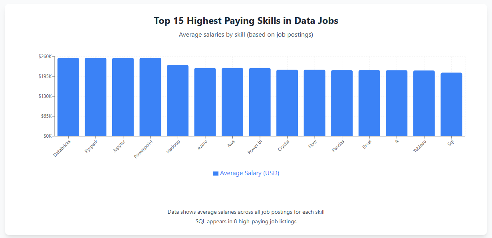

TO do: update content later

# Introduction

In this SQL portfolio project, the analysis aimed towards getting a better understanding of the job market by focusing on job postings for Data Analysts. This project explores the top-paying jobs, the most in-demand skills and observes the correlation between the high in-demand skills and the average salary linked to them specifically for the Data analytics field.

# Background

This project was a part of an SQL online class seeking to find a deeper understanding of the Data Analyst job requirements and benefits. It created a better understanding of the most in-demand skills and the pay related to said skills making my future job search in the field more targeted, specific and effective.
The data set used for this analysis has been provided in Luke Barousse’s [SQL course](https://www.lukebarousse.com/sql). This Data includes details on job titles, salaries, location, and required skills. The course is heavily foccused on the US market, thus making the results not completly accurate to my reality, which is why I will be comparing some of the overall results to the canadian reality.
The questions I wanted to answer through my SQL queries were:

1. What are the top-paying data analyst jobs?
2. What skills are required for these top-paying jobs?
3. What skills are most in demand for data analysts?
4. Which skills are associated with higher salaries?
5. What are the most optimal skills to learn for a data analyst looking to maximize job market value?

# Tools I used

In this project, I used a variety of tools to conduct my analysis and to add visualizations to some part:

- **SQL**(Structured Query Language): Used to interact with the database, extract insights, and answer my key questions through queries.
- **\*PostgreSQL**: As the database management system, PostgreSQL allowed me to store, query, and manipulate the job posting data.
- **Visual Studio Code**(VS Code):This open-source administration and development platform helped me manage the database and execute SQL queries.
- **Git and Github** : Used to create an online reposetary and share this project!

# The Analysis

Each query for this project was done with the objective of finding specific aspects of the data analyst job market. Here is the approach for each question:

### 1. Top Paying Data Analyst Jobs

To identify the highest-paying roles, I filtered data analyst positions by average yearly salary and location, focusing on remote jobs. This query highlights the high paying opportunities in the field.

```SQL
SELECT
    job_id,
    job_title,
    job_location,
    job_schedule_type,
    salary_year_avg,
    job_posted_date

FROM job_postings_fact
WHERE
    job_title_short = 'Data Analyst'
   AND salary_year_avg IS NOT NULL
   AND job_location = 'Anywhere'
ORDER BY salary_year_avg DESC
LIMIT 10;
```

### Here is a chart visualization of the results found by the query.


### I also ran a updated query to find the Top Highest Paying Data Analyst Jobs in Cananda in 2023.


### 2. Skills for top paying jobs

**BLABLABLA**

```SQL
WITH top_paying_jobs AS (
    SELECT
        job_id,
        job_title,
        salary_year_avg
    FROM job_postings_fact
    WHERE
        job_title_short = 'Data Analyst'
        AND job_location = 'Anywhere'
        AND salary_year_avg IS NOT NULL
    ORDER BY salary_year_avg DESC
    LIMIT 10
)

SELECT
    top_paying_jobs.job_id,
    job_title,
    salary_year_avg,
    skills_dim.skills
FROM top_paying_jobs
INNER JOIN skills_job_dim ON top_paying_jobs.job_id=skills_job_dim.job_id
INNER JOIN skills_dim ON skills_job_dim.skill_id = skills_dim.skill_id
/* This join allows us to list the skills associated with each of these top-paying jobs.
We only want to include jobs where there’s a skill associated with it. */
ORDER BY
    salary_year_avg DESC;
```



### And for Canada:


### 3. In-Demand Skills for Data Analysts

**BLABLABLA**

```SQL
SELECT
   skills_dim.skills,
   COUNT(skills_job_dim.job_id) AS demand_count
FROM job_postings_fact
INNER JOIN
    skills_job_dim ON job_postings_fact.job_id = skills_job_dim.job_id
INNER JOIN
     skills_dim ON skills_job_dim.skill_id=skills_dim.skill_id
WHERE
    job_postings_fact.job_title_short= 'Data Analyst'
GROUP BY
    skills_dim.skills
ORDER BY
demand_count DESC
LIMIT 5;
```

### Here are the Top 5 most demanded skills

| Skill    | Demand Count |
| -------- | ------------ |
| SQL      | 92,628       |
| Excel    | 67,031       |
| Python   | 57,326       |
| Tableau  | 46,554       |
| Power BI | 39,468       |

**These skills were also the top 5 most in demand in Canada.**

### 4. Skills based on Salary

**BLABLABLA**

```SQL
SELECT
    skills_dim.skills AS skill,
   ROUND(avg(job_postings_fact.salary_year_avg)) AS avg_salary
FROM job_postings_fact
    INNER JOIN
        skills_job_dim ON job_postings_fact.job_id=skills_job_dim.job_id
    INNER JOIN
        skills_dim ON skills_job_dim.skill_id=skills_dim.skill_id
WHERE
    job_postings_fact.job_title_short='Data Analyst'
    AND job_postings_fact.salary_year_avg IS NOT NULL
GROUP BY
    skill
ORDER BY
    avg_salary DESC
Limit 10 ;
```

### Top 10 Highest Paying Skills

| Rank | Skill     | Average Salary |
| ---- | --------- | -------------- |
| 1    | SVN       | $400,000       |
| 2    | Solidity  | $179,000       |
| 3    | Couchbase | $160,515       |
| 4    | DataRobot | $155,486       |
| 5    | Golang    | $155,000       |
| 6    | MXNet     | $149,000       |
| 7    | dplyr     | $147,633       |
| 8    | VMware    | $147,500       |
| 9    | Terraform | $146,734       |
| 10   | Twilio    | $138,500       |

### Top Paying Skills in Canada

| Rank | Skill      | Average Salary (USD) |
| ---- | ---------- | -------------------- |
| 1    | Looker     | $130,250             |
| 2    | Snowflake  | $123,333             |
| 3    | Redshift   | $120,000             |
| 4    | TypeScript | $108,416             |
| 5    | BigQuery   | $107,833             |
| 6    | Spark      | $107,479             |
| 7    | Hadoop     | $107,167             |
| 8    | AWS        | $105,000             |
| 9    | GCP        | $105,000             |
| 10   | Azure      | $103,671             |

### 5. Most Optimal Skills to Learn

```SQL
WITH skills_demand AS (
    SELECT
         skills_dim.skill_id,
         skills_dim.skills,
         COUNT(skills_job_dim.job_id) AS demand_count
FROM
    job_postings_fact
    INNER JOIN
        skills_job_dim ON job_postings_fact.job_id=skills_job_dim.job_id
    INNER JOIN
        skills_dim ON skills_job_dim.skill_id=skills_dim.skill_id
WHERE
    job_postings_fact.job_title_short = 'Data Analyst'
    AND job_postings_fact.salary_year_avg IS NOT NULL
    AND job_postings_fact.job_work_from_home = True
GROUP BY
    skills_dim.skill_id
),

average_salary AS (
    SELECT
    skills_job_dim.skill_id,
   ROUND(avg(job_postings_fact.salary_year_avg)) AS avg_salary
FROM job_postings_fact
    INNER JOIN
        skills_job_dim ON job_postings_fact.job_id=skills_job_dim.job_id
    INNER JOIN
        skills_dim ON skills_job_dim.skill_id=skills_dim.skill_id
WHERE
    job_postings_fact.job_title_short='Data Analyst'
    AND job_postings_fact.salary_year_avg IS NOT NULL
    AND job_postings_fact.job_work_from_home = TRUE
GROUP BY
    skills_job_dim.skill_id
)

SELECT
    skills_demand.skills,
    skills_demand.demand_count,
    average_salary.avg_salary
FROM
    skills_demand
    INNER JOIN
        average_salary ON skills_demand.skill_id=average_salary.skill_id
ORDER BY
    demand_count DESC,
    avg_salary DESC
LIMIT 10;
```

# Optimal Skills - High Demand & High Salary

| Rank | Skill      | Demand Count | Average Salary |
| ---- | ---------- | ------------ | -------------- |
| 1    | SQL        | 398          | $97,237        |
| 2    | Excel      | 256          | $87,288        |
| 3    | Python     | 236          | $101,397       |
| 4    | Tableau    | 230          | $99,288        |
| 5    | R          | 148          | $100,499       |
| 6    | Power BI   | 110          | $97,431        |
| 7    | SAS        | 63           | $98,902        |
| 8    | PowerPoint | 58           | $88,701        |
| 9    | Looker     | 49           | $103,795       |

# Optimal Skills in Canada - High Demand & High Salary

| Rank | Skill    | Demand Count | Average Salary (USD) |
| ---- | -------- | ------------ | -------------------- |
| 1    | SQL      | 17           | $97,237              |
| 2    | Python   | 14           | $101,397             |
| 3    | Tableau  | 10           | $99,288              |
| 4    | Excel    | 9            | $87,288              |
| 5    | Power BI | 5            | $97,431              |
| 6    | Spark    | 4            | $99,077              |
| 7    | SAS      | 4            | $98,902              |
| 8    | VBA      | 4            | $88,783              |
| 9    | Sheets   | 4            | $86,088              |

# What I learned

Throughout this project, I applied several SQL techniques and skills learned through Luke Barousse's online course:

- **Complex query construction**:
- **Data aggregation**:
- **Analytical thinking**:
- **Creating Readme files**:

# Insights

From this analysis, we could come to the following conclusions:

1. **Top-Paying Data Analyst Jobs**: The highest-paying jobs for data analysts that allow remote work offer a wide range of salaries, the highest at $650,000!
2. **Skills for Top-Paying Jobs**: High-paying data analyst jobs require advanced proficiency in SQL, suggesting it’s a critical skill for earning a top salary.
3. **Most In-Demand Skills**: SQL is also the most demanded skill in the data analyst job market, thus making it essential for job seekers.
4. **Skills with Higher Salaries**: Specialized skills, such as SVN and Solidity, are associated with the highest average salaries, indicating a premium on niche expertise.
5. **Optimal Skills for Job Market Value**: SQL leads in demand and offers for a high average salary, positioning it as one of the most optimal skills for data analysts to learn to maximize their market value.

# Conclusion
